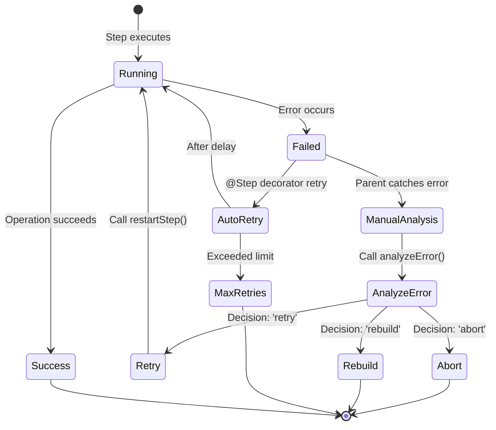

# Restart Pattern

## Table of Contents

- [Overview](#overview)
- [Architecture](#architecture)
- [Step Decorator Configuration](#step-decorator-configuration)
- [Parent-Driven Restart Pattern](#parent-driven-restart-pattern)
- [Error Criteria Configuration](#error-criteria-configuration)
- [State Preservation](#state-preservation)
- [Restart vs Reflection](#restart-vs-reflection)
- [Best Practices](#best-practices)
- [API Reference](#api-reference)

## Overview

The restart pattern enables intelligent retry logic for workflow steps that may fail transiently. Unlike simple retry loops, the restart pattern provides:

- **Parent-driven decisions**: Parent workflows analyze child errors and decide whether to retry, abort, or rebuild
- **State preservation**: `@ObservedState` fields persist across restart attempts
- **Error analysis**: Intelligent classification of errors based on transient detection and custom criteria
- **Event observability**: `stepRetry` and `stepRestarted` events provide full visibility into retry attempts

This pattern is ideal for operations that may fail due to temporary conditions like network timeouts, rate limits, or service unavailability.

**Key Concepts:**

1. **Automatic Retry**: The `@Step` decorator can automatically retry failed steps based on configured criteria
2. **Manual Restart**: Parent workflows can manually restart child steps using `restartStep()`
3. **Error Analysis**: The `analyzeError()` method provides intelligent restart recommendations

## Architecture

The restart pattern follows a parent-driven architecture where decision-making happens at the parent workflow level:



**Flow Explanation:**

1. **Step Execution**: A `@Step` decorated method executes
2. **Error Occurs**: The step throws an error, caught by the decorator's retry loop
3. **Automatic Retry**: If `restartable: true` and error matches criteria, the decorator retries automatically
4. **Manual Analysis**: If automatic retry is disabled or fails, the parent catches the error and calls `analyzeError()`
5. **Restart Decision**: Based on the analysis, the parent may call `restartStep()` to retry the step
6. **State Preservation**: All `@ObservedState` fields persist across restart attempts

## Step Decorator Configuration

The `@Step` decorator supports several options for configuring restart behavior:

### Restart Options

| Option | Type | Default | Description |
|--------|------|---------|-------------|
| `restartable` | `boolean` | `false` | Enable automatic retry on failure |
| `maxRetries` | `number` | `3` | Maximum number of retry attempts |
| `retryDelayMs` | `number` | `1000` | Delay between retries in milliseconds |
| `retryOn` | `ErrorCriterion[]` | `undefined` | Error criteria that trigger retry |

### Basic Automatic Retry

```typescript
import { Workflow, Step } from 'groundswell';

class TransientWorkflow extends Workflow {
  @ObservedState()
  attemptCount = 0;

  @Step({ restartable: true, maxRetries: 3, retryDelayMs: 1000 })
  async flakyOperation(): Promise<string> {
    this.attemptCount++;

    // Simulate transient failure on first attempt
    if (this.attemptCount === 1) {
      throw new Error('TIMEOUT: Request timed out');
    }

    return 'success';
  }

  async run(): Promise<string> {
    return await this.flakyOperation();
  }
}
```

**Behavior:**
- Step fails on first attempt with `TIMEOUT` error
- Decorator waits 1000ms, then retries automatically
- Step succeeds on second attempt
- `attemptCount` is `2` after completion (state preserved across retry)

### Transient Error Pattern

```typescript
@Step({
  restartable: true,
  maxRetries: 3,
  retryDelayMs: 2000,
  retryOn: [
    { code: 'TIMEOUT' },
    { code: 'RATE_LIMIT' },
    { code: 'NETWORK_ERROR' },
    { code: 'SERVICE_UNAVAILABLE' }
  ]
})
async apiCall(): Promise<void> {
  // Operation that may fail transiently
}
```

### Regex Pattern Matching

```typescript
@Step({
  restartable: true,
  maxRetries: 5,
  retryOn: [
    { code: /TIMEOUT|NETWORK_ERROR|ETIMEDOUT/ }
  ]
})
async networkOperation(): Promise<void> {
  // Matches any error message containing these patterns
}
```

### Recoverable Flag Matching

```typescript
@Step({
  restartable: true,
  retryOn: [
    { recoverable: true }
  ]
})
async operation(): Promise<void> {
  const error = new Error('Temporary failure');
  (error as any).recoverable = true;
  throw error;
}
```

### Custom Predicate

```typescript
@Step({
  restartable: true,
  retryOn: [
    (error) => {
      // Complex retry logic
      const isTemporary = error.message.includes('temporary');
      const isTimeout = error.message === 'TIMEOUT';
      const hasRetryableStatus = error.original?.status >= 500;
      return isTemporary || isTimeout || hasRetryableStatus;
    }
  ]
})
async complexOperation(): Promise<void> {
  // Custom error matching logic
}
```

### The `maxRetries: 0` Pattern

> **Gotcha:** `maxRetries: 0` means NO automatic retry

This is a critical pattern for parent-driven restart. Setting `maxRetries: 0` causes the step to fail immediately, allowing the parent workflow to catch the error and drive the restart decision manually.

```typescript
class ChildWorkflow extends Workflow {
  @ObservedState()
  attemptCount = 0;

  @ObservedState()
  stepName: string | null = null;

  // CRITICAL: maxRetries: 0 means no automatic retry
  // Parent must handle error and call restartStep()
  @Step({
    restartable: true,
    maxRetries: 0,
    retryOn: [{ code: /TRANSIENT_ERROR/ }]
  })
  async flakyOperation(): Promise<string> {
    this.stepName = 'flakyOperation';
    this.attemptCount++;

    if (this.attemptCount === 1) {
      throw new Error('TRANSIENT_ERROR: Temporary failure');
    }

    return 'success';
  }
}
```

**Why use `maxRetries: 0`?**
- Gives parent full control over retry logic
- Enables intelligent error analysis before retry
- Allows custom retry delays or backoff strategies
- Prevents automatic retries when you need manual intervention

## Parent-Driven Restart Pattern

The parent-driven restart pattern enables intelligent error handling by having parent workflows analyze child errors and decide whether to retry.

### Complete Parent-Child Example

```typescript
import { Workflow, Step, Task, ObservedState } from 'groundswell';

class ChildWorkflow extends Workflow {
  @ObservedState()
  attemptCount = 0;

  @ObservedState()
  lastError: string | null = null;

  @ObservedState()
  stepName: string | null = null;

  constructor(name: string, parent?: Workflow) {
    super(name, parent);
  }

  @Step({ restartable: true, maxRetries: 0, retryOn: [{ code: /TRANSIENT_ERROR/ }] })
  async flakyOperation(): Promise<string> {
    this.stepName = 'flakyOperation';
    this.attemptCount++;

    if (this.attemptCount === 1) {
      this.lastError = 'TRANSIENT_ERROR';
      throw new Error('TRANSIENT_ERROR: Temporary failure');
    }

    return 'success';
  }

  async run(): Promise<string> {
    return await this.flakyOperation();
  }
}

class ParentWorkflow extends Workflow {
  @ObservedState()
  restartAttempts = 0;

  @ObservedState()
  lastDecision: string | null = null;

  constructor(name: string) {
    super(name);
  }

  @Task()
  async spawnChild(): Promise<ChildWorkflow> {
    return new ChildWorkflow('Child', this);
  }

  async run(): Promise<string> {
    const child = await this.spawnChild();

    try {
      return await child.run();
    } catch (error) {
      const wfError = error as WorkflowError;

      // CRITICAL: Call child's analyzeError, not parent's
      // The child has the stepMetadata for flakyOperation
      const decision = child.analyzeError(wfError);
      this.lastDecision = decision;

      if (decision === 'retry') {
        this.restartAttempts++;

        // CRITICAL: restartStep executes the step, don't call child.run() again
        const result = await child.restartStep('flakyOperation', { retryCount: 1 }) as string;
        return result;
      }

      throw error;
    }
  }
}
```

**Flow Explanation:**

1. **Child Spawning**: Parent uses `@Task` decorator to spawn child workflow
2. **Child Execution**: Child runs and fails on first attempt
3. **Error Propagation**: Error propagates to parent's try-catch block
4. **Error Analysis**: Parent calls `child.analyzeError()` to get restart decision
5. **Manual Restart**: If decision is `'retry'`, parent calls `child.restartStep()` with retry count
6. **State Preservation**: Child's `attemptCount` and `lastError` persist across restart

### Using `analyzeError()`

The `analyzeError()` method analyzes a `WorkflowError` and returns a recommended action:

```typescript
type RestartDecision = 'retry' | 'abort' | 'rebuild';

class ParentWorkflow extends Workflow {
  async run(): Promise<void> {
    const child = await this.spawnChild();

    try {
      await child.run();
    } catch (error) {
      const decision = child.analyzeError(error as WorkflowError);

      switch (decision) {
        case 'retry':
          // Retry the failed step
          await child.restartStep('stepName', { retryCount: 1 });
          break;
        case 'abort':
          // Stop execution, propagate error
          throw error;
        case 'rebuild':
          // Trigger plan rebuild logic
          await this.rebuildExecutionPlan();
          break;
      }
    }
  }
}
```

**Analysis Flow:**

1. Check `error.original?.recoverable` - if `false`, return `'abort'`
2. Extract step name from `error.state?.stepName`
3. Retrieve step metadata from `stepMetadata` map
4. Check if step is marked as `restartable`
5. Match error against `retryOn` criteria
6. Return `'retry'` if criteria matches, otherwise `'abort'`

### Using `restartStep()`

The `restartStep()` method manually re-executes a failed step:

```typescript
interface RestartStepOptions {
  retryCount?: number;      // Current retry attempt number
  maxRetries?: number;      // Maximum retry attempts (default: 3)
  stateOverride?: object;   // Optional state to restore
}

class ParentWorkflow extends Workflow {
  async run(): Promise<void> {
    const child = await this.spawnChild();

    try {
      await child.run();
    } catch (error) {
      // Restart with default options
      await child.restartStep('operationName');

      // Restart with explicit retry count
      await child.restartStep('operationName', { retryCount: 1 });

      // Restart with custom max retries
      await child.restartStep('operationName', {
        retryCount: 1,
        maxRetries: 5
      });

      // Restart with state override
      await child.restartStep('operationName', {
        retryCount: 1,
        stateOverride: { counter: 5 }
      });
    }
  }
}
```

**Important Notes:**

- `restartStep()` executes the step directly - don't call `workflow.run()` again
- State is preserved by default (uses `@ObservedState` fields)
- Throws error if retry count exceeds `maxRetries`
- Emits `stepRestarted` event on success

## Error Criteria Configuration

Error criteria determine which errors should trigger a retry. The `ErrorCriterion` type supports four patterns:

### 1. Exact Code Match

Match errors with a specific error code:

```typescript
@Step({
  restartable: true,
  retryOn: [
    { code: 'TIMEOUT' },
    { code: 'RATE_LIMIT_EXCEEDED' },
    { code: 'NETWORK_ERROR' }
  ]
})
async operation(): Promise<void> {
  // Retries only if error.message exactly matches one of these codes
}
```

> **Gotcha:** `WorkflowError` doesn't have a `code` property
>
> The error code is matched against `error.message`, not `error.code`. This is a known limitation of the `WorkflowError` interface.

### 2. Regex Pattern Match

Match errors using regular expressions:

```typescript
@Step({
  restartable: true,
  retryOn: [
    { code: /TIMEOUT|NETWORK_ERROR|ETIMEDOUT/ },
    { code: /rate.?limit/i }  // Case-insensitive
  ]
})
async operation(): Promise<void> {
  // Retries if error.message matches any pattern
}
```

### 3. Recoverable Flag Match

Match errors based on their `recoverable` property:

```typescript
@Step({
  restartable: true,
  retryOn: [
    { recoverable: true }  // Retry only recoverable errors
  ]
})
async operation(): Promise<void> {
  const error = new Error('Temporary failure');
  (error as any).recoverable = true;
  throw error;
}
```

**How it works:**
- Checks `error.original?.recoverable` for the flag
- If `recoverable` field doesn't exist, defaults to `true`
- Useful for integration with external error types

### 4. Custom Predicate

Use a function for complex matching logic:

```typescript
@Step({
  restartable: true,
  retryOn: [
    (error) => {
      // Check for temporary errors
      if (error.message.includes('temporary')) return true;

      // Check for timeout errors
      if (error.message === 'TIMEOUT') return true;

      // Check for HTTP 5xx errors
      const status = (error.original as any)?.status;
      if (status && status >= 500 && status < 600) return true;

      // Check for rate limiting
      if (error.message.includes('rate limit')) return true;

      return false;
    }
  ]
})
async operation(): Promise<void> {
  // Complex retry logic
}
```

### Combining Multiple Criteria

You can combine multiple criteria types:

```typescript
@Step({
  restartable: true,
  retryOn: [
    { code: 'TIMEOUT' },                    // Exact match
    { code: /NETWORK_.*_/ },                // Regex match
    { recoverable: true },                  // Flag match
    (error) => error.message.includes('transient')  // Custom predicate
  ]
})
async operation(): Promise<void> {
  // Retries if ANY criterion matches
}
```

**Matching Logic:**
- If ANY criterion matches, the error is eligible for retry
- Criteria are evaluated in order
- First matching criterion short-circuits the evaluation

### Transient Error Codes

The framework includes built-in detection for common transient errors:

```typescript
const TRANSIENT_ERROR_CODES = [
  'TIMEOUT',               // Operation timed out
  'RATE_LIMIT',            // API rate limit exceeded (HTTP 429)
  'NETWORK_ERROR',         // Network connectivity issues
  'SERVICE_UNAVAILABLE',   // Service temporarily unavailable (HTTP 503)
];
```

These errors are considered safe to retry with high success probability (0.8).

## State Preservation

State preservation is a key feature of the restart pattern. Fields marked with `@ObservedState()` persist across restart attempts, enabling retry counters and error tracking.

### How State Preservation Works

```typescript
import { Workflow, Step, ObservedState } from 'groundswell';

class RetryCounterWorkflow extends Workflow {
  @ObservedState()
  attemptCount = 0;

  @ObservedState()
  lastError: string | null = null;

  @ObservedState()
  successCount = 0;

  @Step({ restartable: true, maxRetries: 3 })
  async flakyOperation(): Promise<string> {
    this.attemptCount++;

    if (this.attemptCount <= 2) {
      this.lastError = `Attempt ${this.attemptCount} failed`;
      throw new Error('TRANSIENT_ERROR');
    }

    this.successCount++;
    return 'success';
  }

  async run(): Promise<string> {
    return await this.flakyOperation();
  }
}
```

**After execution:**
- `attemptCount`: `3` (includes initial attempt + 2 retries)
- `lastError`: `"Attempt 2 failed"` (preserved from last failure)
- `successCount`: `1` (incremented on successful attempt)

### State in Events

The `stepRestarted` event includes the restored state:

```typescript
class EventMonitoringWorkflow extends Workflow {
  async run(): Promise<void> {
    this.addObserver({
      onEvent: (event) => {
        if (event.type === 'stepRestarted') {
          console.log('Step restarted with state:', event.restoredState);
          // Output: { attemptCount: 2, lastError: 'TRANSIENT_ERROR', successCount: 0 }
        }
      }
    });

    await this.flakyOperation();
  }
}
```

### State Override Options

You can override state when manually restarting:

```typescript
class StateOverrideWorkflow extends Workflow {
  @ObservedState()
  counter = 0;

  @Step({ restartable: true, maxRetries: 0 })
  async operation(): Promise<void> {
    this.counter++;
    throw new Error('FAIL');
  }

  async run(): Promise<void> {
    try {
      await this.operation();
    } catch (error) {
      // Restart with overridden state
      await this.restartStep('operation', {
        retryCount: 1,
        stateOverride: { counter: 100 }  // Start from 100 instead of 1
      });
    }
  }
}
```

### State Limitations

> **Gotcha:** State is preserved, not reset

State persists across ALL restart attempts. This means:
- Retry counters continue incrementing
- Error fields retain their last value
- Success counters accumulate

If you need to reset state, use `stateOverride` or manually reset fields:

```typescript
class StateResetWorkflow extends Workflow {
  @ObservedState()
  attemptCount = 0;

  async run(): Promise<void> {
    try {
      await this.operation();
    } catch (error) {
      // Reset state before retry
      this.attemptCount = 0;
      await this.restartStep('operation', { retryCount: 0 });
    }
  }
}
```

## Restart vs Reflection

The framework supports two different approaches to error handling: traditional restart and AI-powered reflection.

### Feature Comparison

| Feature | Restart | Reflection |
|---------|---------|------------|
| **Decision Mechanism** | Parent-driven error analysis | AI analyzes error and context |
| **State Restoration** | Full state preservation via `@ObservedState` | State captured in error context |
| **Use Cases** | Transient errors, rate limits, network failures | Complex errors requiring reasoning |
| **Integration** | `@Step` decorator + `restartStep()` | `enableReflection: true` in config |
| **Performance** | Fast, deterministic retry | Slower, requires AI inference |
| **Success Probability** | Based on error classification | AI estimates based on context |

### When to Use Restart

Use the restart pattern for:
- **Transient errors**: Timeouts, network failures, rate limits
- **Known failure modes**: Errors with predictable retry behavior
- **Performance-critical paths**: Fast retry without AI overhead
- **Deterministic recovery**: Errors that resolve with retry

```typescript
// Best practice: Restart for transient errors
@Step({
  restartable: true,
  retryOn: [
    { code: 'TIMEOUT' },
    { code: 'RATE_LIMIT' },
    { code: 'NETWORK_ERROR' }
  ]
})
async apiCall(): Promise<void> {
  // Fast, deterministic retry
}
```

### When to Use Reflection

Use reflection for:
- **Complex errors**: Failures requiring context analysis
- **Unknown failure modes**: Errors you haven't seen before
- **Recovery planning**: Failures requiring strategy changes
- **Learning scenarios**: Building error recovery knowledge

```typescript
// Best practice: Reflection for complex errors
const workflow = createWorkflow(
  { enableReflection: true },
  async (ctx) => {
    // AI analyzes errors and suggests fixes
  }
);
```

### Integration Pattern

You can combine both approaches:

```typescript
class HybridWorkflow extends Workflow {
  @Step({ restartable: true, retryOn: [{ code: 'TIMEOUT' }] })
  async fastPath(): Promise<void> {
    // Quick retry for known errors
  }

  async run(): Promise<void> {
    try {
      await this.fastPath();
    } catch (error) {
      // Fall back to reflection for unknown errors
      const aiAnalysis = await this.reflectOnError(error);
      if (aiAnalysis.suggestedAction === 'retry') {
        await this.restartStep('fastPath');
      }
    }
  }
}
```

## Best Practices

### When to Mark Steps Restartable

**Do mark restartable:**
- Network operations (API calls, database queries)
- File I/O operations (temporary file locks, permissions)
- External service calls (third-party APIs, cloud services)
- Stateful operations with idempotent behavior

**Don't mark restartable:**
- Non-idempotent operations (payments, email sends)
- Operations with side effects (queue pushes, event publishing)
- Quick operations (retry overhead exceeds cost)
- Validation logic (invalid input won't become valid)

### Retry Limit Guidelines

| Operation Type | Recommended `maxRetries` | Reason |
|----------------|------------------------|--------|
| Network calls | 3-5 | Balance between resilience and latency |
| Database operations | 2-3 | Quick feedback loops |
| File I/O | 3 | Temporary locks usually clear quickly |
| Third-party APIs | 5-10 | Rate limits may require longer waits |
| Batch processing | 1-2 | Large operations expensive to retry |

### Performance Considerations

1. **Retry delays compound quickly**: With `retryDelayMs: 1000` and `maxRetries: 5`, total wait time is 5 seconds
2. **State snapshots have overhead**: Large state objects slow down retry loops
3. **Event emission is synchronous**: Each retry emits events that complete before retry
4. **Parent-child context switching**: Manual restart requires parent analysis overhead

### Common Pitfalls

#### 1. Forgetting `maxRetries: 0` for Parent-Driven Restart

```typescript
// WRONG: Step retries automatically, parent never sees error
@Step({ restartable: true, maxRetries: 3 })
async operation(): Promise<void> {
  throw new Error('FAIL');
}

// CORRECT: Step fails immediately, parent can analyze
@Step({ restartable: true, maxRetries: 0 })
async operation(): Promise<void> {
  throw new Error('FAIL');
}
```

#### 2. Not Populating `stepMetadata`

> **Gotcha:** `@Step` decorator doesn't populate `stepMetadata`

```typescript
// In tests, manually populate stepMetadata for analyzeError to work
(child as any).stepMetadata = new Map([
  ['operationName', { options: { restartable: true, maxRetries: 0 } }]
]);
```

#### 3. Calling Parent's `analyzeError` Instead of Child's

```typescript
// WRONG: Parent doesn't have child's stepMetadata
const decision = this.analyzeError(error);

// CORRECT: Child has its own stepMetadata
const decision = child.analyzeError(error);
```

#### 4. Calling `workflow.run()` After `restartStep()`

```typescript
// WRONG: restartStep already executed the step
await child.restartStep('operation');
await child.run();  // Runs operation AGAIN

// CORRECT: restartStep executes the step
const result = await child.restartStep('operation');
// Use result directly
```

#### 5. Using `error.code` Instead of `error.message`

> **Gotcha:** `WorkflowError` doesn't have a `code` property

```typescript
// WRONG: error.code doesn't exist
{ code: 'TIMEOUT' }  // Won't match anything

// CORRECT: Use error.message for code matching
{ code: /TIMEOUT/ }  // Matches error.message
```

#### 6. Not Checking `typeof criterion === 'function'` First

```typescript
// WRONG: Functions can have properties, breaking discriminant checks
if ('code' in criterion) { /* ... */ } else if (typeof criterion === 'function') { /* ... */ }

// CORRECT: Check function FIRST
if (typeof criterion === 'function') { /* ... */ } else if ('code' in criterion) { /* ... */ }
```

### Monitoring and Observability

Enable comprehensive logging for restart workflows:

```typescript
class ObservableWorkflow extends Workflow {
  @Step({
    restartable: true,
    logStart: true,
    logFinish: true,
    retryDelayMs: 1000
  })
  async observedOperation(): Promise<void> {
    // Logs emitted for each retry attempt
  }

  async run(): Promise<void> {
    this.addObserver({
      onEvent: (event) => {
        if (event.type === 'stepRetry') {
          console.log(`Retry ${event.retryCount}: ${event.analysis.reason}`);
        }
        if (event.type === 'stepRestarted') {
          console.log(`Step restarted: ${event.stepName}`);
        }
      }
    });

    await this.observedOperation();
  }
}
```

## API Reference

### StepOptions (Restart Fields)

```typescript
interface StepOptions {
  /** Enable automatic retry on failure */
  restartable?: boolean;

  /** Maximum number of retry attempts */
  maxRetries?: number;

  /** Delay between retries in milliseconds */
  retryDelayMs?: number;

  /** Error criteria that trigger retry */
  retryOn?: ErrorCriterion[];
}
```

**Source:** `src/types/decorators.ts:8-27`

### restartStep()

```typescript
public async restartStep(
  stepName: string,
  options?: RestartStepOptions
): Promise<unknown>
```

Manually re-execute a failed step.

**Parameters:**
- `stepName`: Name of the step method to restart
- `options`: Optional restart configuration

**Returns:** Promise with the step's return value

**Throws:** `WorkflowError` if:
- Step not found
- Retry count exceeds `maxRetries`

**Source:** `src/core/workflow.ts:506-563`

### RestartStepOptions

```typescript
interface RestartStepOptions {
  /** Current retry attempt number (default: 0) */
  retryCount?: number;

  /** Maximum retry attempts (default: 3) */
  maxRetries?: number;

  /** Optional state to restore */
  stateOverride?: Record<string, unknown>;
}
```

### analyzeError()

```typescript
public analyzeError(error: WorkflowError): 'retry' | 'abort' | 'rebuild'
```

Analyze a `WorkflowError` and determine the recommended action.

**Parameters:**
- `error`: The workflow error to analyze

**Returns:**
- `'retry'`: Error matches retry criteria, safe to retry
- `'abort'`: Error is non-recoverable or step not restartable
- `'rebuild'`: Requires plan rebuild (rare, currently unused)

**Source:** `src/core/workflow.ts:650-689`

### ErrorCriterion

```typescript
type ErrorCriterion =
  | { code: string | RegExp }        // Match by error code
  | { recoverable: boolean }         // Match by recoverable flag
  | ((error: WorkflowError) => boolean);  // Custom predicate
```

**Source:** `src/types/restart.ts:132-136`

### RestartAnalysis

```typescript
interface RestartAnalysis {
  /** Whether the step should be restarted */
  shouldRestart: boolean;

  /** Human-readable reason for the restart decision */
  reason: string;

  /** Suggested action to take */
  suggestedAction: 'retry' | 'abort' | 'rebuild';

  /** Estimated probability of success (0-1) */
  estimatedSuccessProbability: number;
}
```

**Source:** `src/types/restart.ts:48-60`

### Event Types

#### stepRetry

Emitted when the `@Step` decorator automatically retries a step.

```typescript
interface StepRetryEvent {
  type: 'stepRetry';
  node: WorkflowNode;
  stepName: string;
  retryCount: number;
  analysis: RestartAnalysis;
  error: WorkflowError;
  timestamp: number;
}
```

#### stepRestarted

Emitted when a step is manually restarted via `restartStep()`.

```typescript
interface StepRestartedEvent {
  type: 'stepRestarted';
  node: WorkflowNode;
  stepName: string;
  retryCount: number;
  restoredState: Record<string, unknown>;
  timestamp: number;
}
```

**Source:** `src/core/workflow.ts:553-560`

---

**See also:**
- [Workflow Documentation](./workflow.md) - Basic workflow usage and decorators
- [Agent Documentation](./agent.md) - Agent integration with workflows
- [Integration Tests](../src/__tests__/integration/parent-restart-decisions.test.ts) - Working examples
