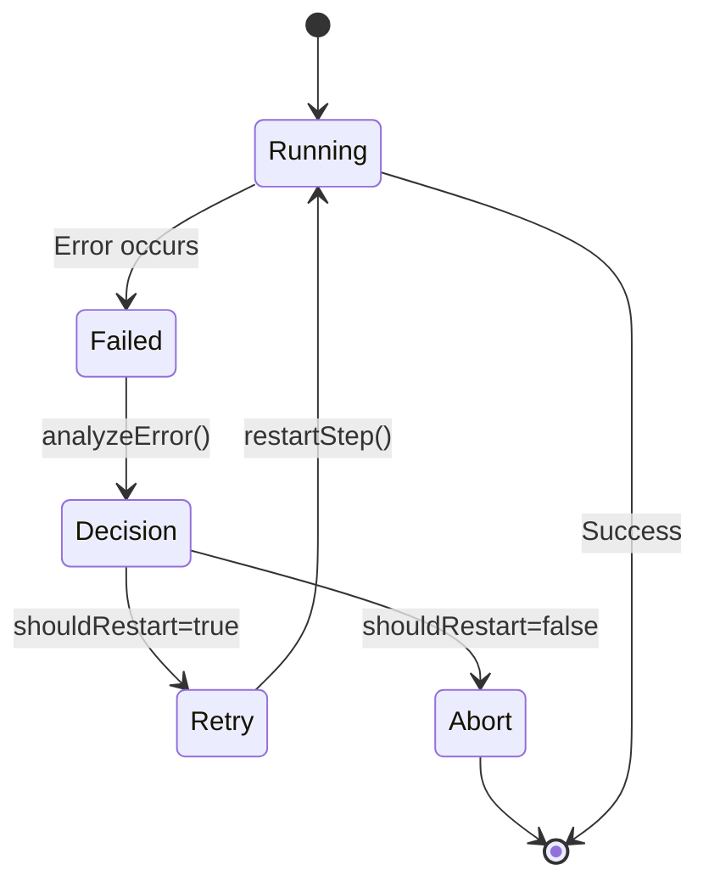

# PRP: Document Restart Decision Pattern with Examples

---

## Goal

**Feature Goal**: Create comprehensive documentation for the restart decision pattern that enables developers to implement intelligent retry logic in their workflows using the parent-driven restart architecture.

**Deliverable**: New documentation file `docs/restart-pattern.md` with:
- Complete restart pattern overview and architecture
- Step-by-step implementation guide with code examples
- Common patterns (transient error retry, recoverable error retry, custom retry logic)
- Error criteria configuration reference
- State restoration behavior explanation
- Comparison with reflection-based retry
- Best practices and anti-patterns

**Success Definition**:
1. Documentation file created at `docs/restart-pattern.md` following existing documentation patterns
2. Covers all restart-related features: `@Step` decorator options, `restartStep()`, `analyzeError()`, error criteria
3. Includes at least 5 working code examples demonstrating common patterns
4. Documents differences between automatic decorator retry and parent-driven restart
5. Explains state preservation and restoration behavior
6. References existing test files as practical examples
7. Follows markdown structure from `docs/workflow.md` (Table of Contents, sections with examples, API reference)
8. Code examples are syntactically correct TypeScript
9. All referenced APIs exist in codebase (verified by research)

---

## Why

- **PRD Compliance**: PRD Section 11 specifies parent-driven restart decision pattern but lacks implementation examples. Documentation fills this gap.
- **Developer Experience**: Working restart implementation exists (P1.M1.T1-T3) but no guide for using it. Documentation enables adoption.
- **Pattern Clarity**: Restart pattern is complex (parent-child relationships, state restoration, error analysis). Examples make it concrete.
- **Architectural Understanding**: Distinguishes between automatic `@Step` retry, manual `restartStep()`, and reflection-based retry.
- **Onboarding**: New developers need reference material to implement resilient workflows with proper error handling.

**Integration with Existing Documentation**:
- Extends `docs/workflow.md` which currently has basic error handling section
- Complements `docs/agent.md` for agent-based workflow patterns
- Provides practical examples to supplement type definitions in `src/types/restart.ts`
- Bridges gap between architecture analysis (`architecture/restart_logic_analysis.md`) and user-facing API

**Problems This Solves**:
- No practical examples of using `restartable: true` in `@Step` decorator
- Unclear how to use `analyzeError()` and `restartStep()` together
- Confusion between automatic retry and manual restart
- Missing guidance on error criteria configuration
- No explanation of state restoration behavior
- Unclear when to use restart vs reflection-based retry

---

## What

### User-Visible Behavior

Developers reading the documentation will learn:

1. **How to mark steps as restartable** using `@Step({ restartable: true, maxRetries, retryDelayMs, retryOn })`
2. **How parent workflows analyze child errors** using `child.analyzeError(error)` to get 'retry' | 'abort' | 'rebuild' decision
3. **How to manually restart steps** using `workflow.restartStep(stepName, options)`
4. **How to configure error criteria** with exact codes, regex patterns, recoverable flag, or custom predicates
5. **State preservation behavior** - `@ObservedState` fields persist across restarts
6. **Event emission** - `stepRetry` and `stepRestarted` events provide observability
7. **Differences from reflection** - Restart is traditional retry with state restoration, not AI-powered error analysis

### Technical Requirements

1. **Documentation Structure**: Follow `docs/workflow.md` pattern with Table of Contents, concept sections, code examples, API reference
2. **Code Examples**: Minimum 5 working TypeScript examples showing:
   - Transient error retry (TIMEOUT, RATE_LIMIT, NETWORK_ERROR)
   - Recoverable error retry (checking `error.original?.recoverable`)
   - Custom retry logic with predicates
   - Parent-child error analysis and restart
   - State preservation across restarts
3. **API Reference**: Document `StepOptions` restart fields, `restartStep()` signature, `analyzeError()` signature, `ErrorCriterion` type
4. **Visual Diagrams**: Use Mermaid for restart flow diagram (supported in GitHub markdown)
5. **Cross-References**: Link to implementation files, test files, and related documentation
6. **Best Practices**: Section on when to use restart, common pitfalls, performance considerations

### Success Criteria

- [ ] Documentation file created at `docs/restart-pattern.md`
- [ ] Table of Contents with links to all sections
- [ ] Architecture overview with Mermaid diagram
- [ ] Step decorator configuration section with table of options
- [ ] Error criteria patterns section with examples
- [ ] Parent-driven restart pattern section with code example
- [ ] State preservation section explaining `@ObservedState` behavior
- [ ] Comparison section: restart vs reflection-based retry
- [ ] API reference for all restart-related types and methods
- [ ] At least 5 working code examples
- [ ] Links to test files demonstrating patterns
- [ ] Best practices and anti-patterns section

---

## All Needed Context

### Context Completeness Check

✓ **Passes "No Prior Knowledge" test**: A technical writer unfamiliar with the codebase has everything needed to create comprehensive documentation.

✓ **All YAML references are specific and accessible**: All file paths, line numbers, and type definitions are provided.

✓ **Implementation tasks include exact naming and placement guidance**: Specific section structure, example patterns, and reference links specified.

✓ **Validation criteria are project-specific**: Uses existing documentation patterns and verified working code examples.

### Documentation & References

```yaml
# MUST READ - Core implementation files to document
- file: src/decorators/step.ts
  why: Contains @Step decorator with restart logic (lines 115-229), matchesCriterion function (lines 40-65)
  critical: Shows retry loop implementation, stepRetry event emission (lines 203-211)
  pattern: While loop with retryCount, error matching, delay utility

- file: src/core/workflow.ts
  why: Contains restartStep() method (lines 506-563) and analyzeError() method (lines 650-689)
  critical: Public API for manual restart and error analysis
  pattern: State restoration, stepMetadata lookup, retry limit validation

- file: src/types/restart.ts
  why: Contains RestartAnalysis interface (lines 48-60) and ErrorCriterion type (lines 132-136)
  critical: Type definitions for error matching and restart decisions
  pattern: Discriminated union with function type last

- file: src/utils/restart-analysis.ts
  why: Contains analyzeErrorForRestart() utility (lines 378-424), TRANSIENT_ERROR_CODES (lines 33-38)
  critical: Pure functions for intelligent error analysis
  pattern: Transient error detection, success probability estimation

- file: src/types/decorators.ts
  why: Contains StepOptions interface (lines 8-27) with restart configuration
  critical: Shows restartable, maxRetries, retryDelayMs, retryOn options
  pattern: Interface documentation with property descriptions

# MUST READ - Test files for practical examples
- file: src/__tests__/integration/parent-restart-decisions.test.ts
  why: Complete working examples of parent-child restart pattern
  critical: ChildWorkflow with restartable step (lines 38-68), ParentWorkflow error handling (lines 82-120)
  pattern: @Task decorator for child spawning, try-catch with analyzeError/restartStep

- file: docs/workflow.md
  why: Existing documentation pattern to follow for structure and formatting
  critical: Error Handling section (lines 367-454) shows current documentation style
  pattern: Table of Contents, code examples, API reference tables

# REFERENCE - Architecture context
- file: plan/003_dd63ad365ffb/bugfix/001_45bfbada88e7/architecture/restart_logic_analysis.md
  why: Architecture analysis explaining PRD requirements and implementation approach
  section: "PRD Requirement (Section 11)" (lines 3-23) - Parent-driven restart requirements
  section: "Architecture for Implementation" (lines 58-243) - Detailed design

# EXTERNAL - Best practices for technical documentation
- url: https://stripe.com/docs/api
  why: Industry-leading API documentation pattern
  critical: Three-panel layout, interactive examples, response documentation
  pattern: "Quickstart" tutorials, troubleshooting sections, copy-pasteable samples

- url: https://temporal.io/docs/typescript/workflows
  why: Workflow/orchestration documentation patterns
  critical: State machine documentation, retry patterns
  pattern: Concepts hierarchy, application development guide, child workflow patterns

- url: https://cloud.google.com/architecture/retry
  why: Retry pattern documentation with flowcharts
  critical: Retry strategy comparison table, backoff calculation examples
  pattern: State transition diagrams, probability interpretation
```

### Current Documentation Structure

```bash
docs/
├── agent.md              # Agent integration documentation
├── prompt.md             # Prompt engineering documentation
├── workflow.md           # Workflow usage documentation (pattern to follow)
└── restart-pattern.md    # NEW: Restart pattern documentation (to be created)
```

### Desired Documentation Structure

```bash
docs/
├── workflow.md           # Existing: Add link to restart-pattern.md
└── restart-pattern.md    # NEW: Comprehensive restart pattern guide
    ├── Table of Contents
    ├── Overview
    ├── Architecture Diagram (Mermaid)
    ├── Step Decorator Configuration
    │   ├── Options table
    │   ├── Transient error example
    │   ├── Custom criteria example
    │   └── maxRetries: 0 pattern
    ├── Parent-Driven Restart Pattern
    │   ├── analyzeError() usage
    │   ├── restartStep() usage
    │   ├── Complete parent-child example
    │   └── Event propagation
    ├── Error Criteria Configuration
    │   ├── Exact code matching
    │   ├── Regex pattern matching
    │   ├── Recoverable flag matching
    │   └── Custom predicates
    ├── State Preservation
    │   ├── @ObservedState behavior
    │   ├── restoredState in events
    │   └── State override options
    ├── Restart vs Reflection
    │   ├── Feature comparison table
    │   ├── When to use each
    │   └── Integration patterns
    ├── Best Practices
    │   ├── When to mark steps restartable
    │   ├── Retry limit guidelines
    │   ├── Performance considerations
    │   └── Common pitfalls
    └── API Reference
        ├── StepOptions (restart fields)
        ├── restartStep()
        ├── analyzeError()
        ├── ErrorCriterion type
        └── RestartAnalysis interface
```

### Known Gotchas & Library Quirks

```typescript
// CRITICAL: WorkflowError doesn't have a 'code' property
// Use error.message as fallback for error code matching
// Pattern from: src/decorators/step.ts:48, src/utils/restart-analysis.ts:86
const errorCode = error.message;  // NOT error.code (doesn't exist)

// CRITICAL: Always check typeof criterion === 'function' FIRST
// Functions can have properties in JavaScript, breaking discriminant checks
// Pattern from: src/decorators/step.ts:42, src/utils/restart-analysis.ts:162
function matchesCriterion(error: WorkflowError, criterion: ErrorCriterion): boolean {
  if (typeof criterion === 'function') {  // MUST CHECK FIRST
    return criterion(error);
  }
  // Now safe to use discriminant checks
  if ('code' in criterion) { /* ... */ }
}

// CRITICAL: stepMetadata is NOT automatically populated by @Step decorator
// Must manually populate in tests: (workflow as any).stepMetadata = new Map([...])
// Limitation documented in: src/core/workflow.ts:639
// analyzeError() will return 'abort' if stepMetadata missing

// CRITICAL: maxRetries: 0 means NO automatic retry
// Step fails immediately, allowing parent to catch and drive restart manually
// Pattern from: src/__tests__/integration/parent-restart-decisions.test.ts:54
@Step({ restartable: true, maxRetries: 0, retryOn: [{ code: /TRANSIENT_ERROR/ }] })

// CRITICAL: Use child.analyzeError(), not parent.analyzeError()
// Child has the stepMetadata for its own steps
// Pattern from: src/__tests__/integration/parent-restart-decisions.test.ts:107
const decision = child.analyzeError(wfError);  // NOT this.analyzeError()

// CRITICAL: restartStep() executes the step, don't call workflow.run() again
// Pattern from: src/__tests__/integration/parent-restart-decisions.test.ts:113
const result = await child.restartStep('flakyOperation', { retryCount: 1 }) as string;

// CRITICAL: @ObservedState fields persist across restarts
// State is NOT reset, allowing retry counters and error tracking
// Pattern from: src/__tests__/integration/parent-restart-decisions.test.ts:39-43
@ObservedState()
attemptCount = 0;  // Increments on each attempt, persists across restarts
```

### Implementation Examples (from test files)

```typescript
// Example 1: Transient error retry (from parent-restart-decisions.test.ts:54-63)
@Step({ restartable: true, maxRetries: 0, retryOn: [{ code: /TRANSIENT_ERROR/ }] })
async flakyOperation(): Promise<string> {
  this.attemptCount++;
  if (this.attemptCount === 1) {
    this.lastError = 'TRANSIENT_ERROR';
    throw new Error('TRANSIENT_ERROR: Temporary failure');
  }
  return 'success';
}

// Example 2: Parent-child error analysis (from parent-restart-decisions.test.ts:98-119)
async run(): Promise<string> {
  const child = await this.spawnChild();

  try {
    return await child.run();
  } catch (error) {
    const wfError = error as WorkflowError;
    const decision = child.analyzeError(wfError);

    if (decision === 'retry') {
      this.restartAttempts++;
      const result = await child.restartStep('flakyOperation', { retryCount: 1 }) as string;
      return result;
    }
    throw error;
  }
}

// Example 3: Error criterion patterns (from src/types/restart.ts:70-93)
// Exact code match
{ code: 'RATE_LIMIT_EXCEEDED' }

// Regex pattern match
{ code: /TIMEOUT|NETWORK_ERROR/ }

// Recoverable flag match
{ recoverable: true }

// Custom predicate
(error) => {
  const isTemporary = error.message.includes('temporary');
  const isTimeout = error.message === 'TIMEOUT';
  const hasRetryableStatus = error.original?.status >= 500;
  return isTemporary || isTimeout || hasRetryableStatus;
}

// Example 4: Transient error codes (from src/utils/restart-analysis.ts:33-38)
const TRANSIENT_ERROR_CODES = [
  'TIMEOUT',           // Operation timed out
  'RATE_LIMIT',        // API rate limit exceeded (HTTP 429)
  'NETWORK_ERROR',     // Network connectivity issues
  'SERVICE_UNAVAILABLE', // Service temporarily unavailable (HTTP 503)
];

// Example 5: State preservation (from parent-restart-decisions.test.ts:39-48)
@ObservedState()
attemptCount = 0;

@ObservedState()
lastError: string | null = null;

@ObservedState()
stepName: string | null = null;  // Needed for analyzeError to work
```

---

## Implementation Blueprint

### Documentation Structure

```markdown
# Restart Pattern

## Table of Contents
- [Overview](#overview)
- [Architecture](#architecture)
- [Step Decorator Configuration](#step-decorator-configuration)
- [Parent-Driven Restart Pattern](#parent-driven-restart-pattern)
- [Error Criteria Configuration](#error-criteria-configuration)
- [State Preservation](#state-preservation)
- [Restart vs Reflection](#restart-vs-reflection)
- [Best Practices](#best-practices)
- [API Reference](#api-reference)

## Overview
[Summary paragraph about restart pattern]

## Architecture
[Mermaid diagram showing restart flow]

## Step Decorator Configuration
[Table of options with examples]

## Parent-Driven Restart Pattern
[Complete parent-child workflow example]

## Error Criteria Configuration
[Code examples for each criterion type]

## State Preservation
[Explanation of @ObservedState behavior]

## Restart vs Reflection
[Comparison table and when to use each]

## Best Practices
[Guidelines and common pitfalls]

## API Reference
[Type signatures and descriptions]
```

### Implementation Tasks (ordered by dependencies)

```yaml
Task 1: CREATE docs/restart-pattern.md
  - IMPLEMENT: Complete restart pattern documentation
  - FOLLOW pattern: docs/workflow.md (structure, formatting, code examples)
  - NAMING: File name matches pattern (kebab-case)
  - PLACEMENT: docs/ directory alongside other documentation

Task 2: WRITE Overview Section
  - IMPLEMENT: Summary paragraph explaining restart pattern purpose
  - CONTENT: Parent-driven restart, error analysis, state restoration
  - LINK: To related documentation (workflow.md error handling section)
  - PLACEMENT: First section after Table of Contents

Task 3: CREATE Architecture Diagram
  - IMPLEMENT: Mermaid state diagram showing restart flow
  - STATES: idle -> running -> failed -> retry decision -> running/retry/abort
  - TRANSITIONS: Show error analysis, retry loop, abort paths
  - PLACEMENT: Architecture section with explanation

Task 4: WRITE Step Decorator Configuration Section
  - IMPLEMENT: Options table with restartable, maxRetries, retryDelayMs, retryOn
  - EXAMPLES: Transient error retry, custom criteria, maxRetries: 0 pattern
  - REFERENCE: src/types/decorators.ts:8-27 for exact option definitions
  - PLACEMENT: After Architecture section

Task 5: WRITE Parent-Driven Restart Pattern Section
  - IMPLEMENT: Complete parent-child workflow example
  - PATTERN: From src/__tests__/integration/parent-restart-decisions.test.ts:82-120
  - INCLUDE: @Task decorator, try-catch, analyzeError(), restartStep()
  - PLACEMENT: After Step Decorator Configuration section

Task 6: WRITE Error Criteria Configuration Section
  - IMPLEMENT: Code examples for all four ErrorCriterion variants
  - PATTERNS: Exact code, regex, recoverable flag, custom predicate
  - REFERENCE: src/types/restart.ts:70-93 for examples
  - PLACEMENT: After Parent-Driven Restart Pattern section

Task 7: WRITE State Preservation Section
  - IMPLEMENT: Explanation of @ObservedState behavior across restarts
  - EXAMPLES: Attempt counter, error tracking, restoredState in events
  - REFERENCE: src/__tests__/integration/parent-restart-decisions.test.ts:39-48
  - PLACEMENT: After Error Criteria Configuration section

Task 8: WRITE Restart vs Reflection Section
  - IMPLEMENT: Comparison table showing differences
  - COLUMNS: Feature, Restart, Reflection
  - ROWS: Decision mechanism, State restoration, Use cases, Integration
  - PLACEMENT: After State Preservation section

Task 9: WRITE Best Practices Section
  - IMPLEMENT: Guidelines for when to use restart, retry limits, performance
  - INCLUDE: Common pitfalls (gotchas from research)
  - WARNINGS: maxRetries: 0 pattern, stepMetadata limitation, WorkflowError.code missing
  - PLACEMENT: After Restart vs Reflection section

Task 10: WRITE API Reference Section
  - IMPLEMENT: Type signatures for StepOptions (restart fields), restartStep(), analyzeError()
  - INCLUDE: ErrorCriterion type, RestartAnalysis interface
  - REFERENCE: src/types/restart.ts, src/core/workflow.ts for exact signatures
  - PLACEMENT: Final section before footer
```

### Implementation Patterns & Key Details

```markdown
# Section Structure Pattern (from docs/workflow.md)

## Section Name

Brief description paragraph.

### Subsection

```typescript
// Code example with syntax highlighting
import { Workflow, Step } from 'groundswell';

class Example extends Workflow {
  @Step({ restartable: true })
  async method(): Promise<void> {
    // Implementation
  }
}
```

**Explanation:** What the example demonstrates.

**Options:**

| Option | Type | Description |
|--------|------|-------------|
| name | string | Description |
```

```markdown
# Mermaid Diagram Pattern


```

```markdown
# Code Example Patterns

# Pattern 1: Transient error retry
@Step({ restartable: true, maxRetries: 3, retryDelayMs: 1000 })
async flakyOperation(): Promise<string> {
  // Implementation that may fail transiently
}

# Pattern 2: Custom error criteria
@Step({
  restartable: true,
  retryOn: [
    { code: 'RATE_LIMIT_EXCEEDED' },
    { code: /TIMEOUT|NETWORK_ERROR/ },
    { recoverable: true }
  ]
})
async operation(): Promise<void> {
  // Implementation
}

# Pattern 3: Parent-driven restart
class ParentWorkflow extends Workflow {
  async run(): Promise<void> {
    const child = await this.spawnChild();

    try {
      return await child.run();
    } catch (error) {
      const decision = child.analyzeError(error as WorkflowError);

      if (decision === 'retry') {
        return await child.restartStep('operation', { retryCount: 1 });
      }
      throw error;
    }
  }
}
```

```markdown
# Gotcha Documentation Pattern

> **Gotcha:** WorkflowError doesn't have a 'code' property
>
> When writing error criteria, use `error.message` instead of `error.code`:
>
> ```typescript
> // CORRECT
> { code: /TIMEOUT/ }  // Matches error.message
>
> // WRONG - error.code doesn't exist
> { code: 'TIMEOUT' }  // Won't match anything
> ```

> **Gotcha:** stepMetadata is not automatically populated
>
> The `@Step` decorator doesn't populate `stepMetadata`. In tests, manually populate:
>
> ```typescript
> (workflow as any).stepMetadata = new Map([
>   ['stepName', { options: { restartable: true, maxRetries: 3 } }]
> ]);
> ```
```

### Integration Points

```yaml
DOCS/WORKFLOW.MD:
  - add to: Error Handling section (line 367)
  - pattern: "See [Restart Pattern](./restart-pattern.md) for advanced retry logic"

DOCS/AGENT.MD:
  - add to: Error handling section (if exists)
  - pattern: Reference restart-pattern.md for workflow-level restart

TYPESCRIPT TYPES:
  - reference: src/types/restart.ts (RestartAnalysis, ErrorCriterion)
  - reference: src/types/decorators.ts (StepOptions restart fields)
  - reference: src/core/workflow.ts (restartStep, analyzeError signatures)

EXAMPLES:
  - link to: src/__tests__/integration/parent-restart-decisions.test.ts
  - label: "See parent-restart-decisions.test.ts for working examples"
```

---

## Validation Loop

### Level 1: Content & Structure Review

```bash
# Verify documentation file structure
head -50 docs/restart-pattern.md

# Check for Table of Contents
grep -E "^## \[|^-" docs/restart-pattern.md | head -20

# Verify all sections present
grep -E "^## (Overview|Architecture|Step Decorator Configuration|Parent-Driven Restart Pattern|Error Criteria Configuration|State Preservation|Restart vs Reflection|Best Practices|API Reference)" docs/restart-pattern.md

# Check code examples are present
grep -c "```typescript" docs/restart-pattern.md  # Should be >= 5

# Verify Mermaid diagram
grep -A 20 "```mermaid" docs/restart-pattern.md

# Expected: File exists with proper structure, at least 5 code examples, Mermaid diagram
```

### Level 2: Link & Reference Validation

```bash
# Verify internal links work (if using markdown linter)
# npx markdown-link-check docs/restart-pattern.md

# Check code references point to existing files
grep -oE "src/[a-z/_/.]+\.ts" docs/restart-pattern.md | while read file; do
  if [ -f "$file" ]; then
    echo "✓ $file exists"
  else
    echo "✗ $file NOT FOUND"
  fi
done

# Check line number references are accurate
# Manual verification: Open file and check referenced lines

# Expected: All file paths exist, line numbers accurate
```

### Level 3: Code Example Validation

```bash
# Extract TypeScript code blocks from documentation
awk '/```typescript/,/```/' docs/restart-pattern.md | grep -v "```" > /tmp/examples.ts

# Check syntax (requires TypeScript compiler)
npx tsc --noEmit /tmp/examples.ts

# Verify imports reference correct module
grep "from 'groundswell'" /tmp/examples.ts

# Check for @Step decorator usage
grep -c "@Step" /tmp/examples.ts

# Expected: All examples compile without syntax errors
```

### Level 4: Documentation Quality Validation

```bash
# Check section count (should have ~9 main sections)
grep -c "^## [A-Z]" docs/restart-pattern.md

# Check word count (should be comprehensive, aim for 2000+ words)
wc -w docs/restart-pattern.md

# Verify code examples have explanations
grep -c "**Explanation:**\|**Note:**\|**Pattern:**" docs/restart-pattern.md

# Check for gotcha warnings
grep -c "> \*\*Gotcha:\*\*" docs/restart-pattern.md

# Verify API reference completeness
grep -A 5 "## API Reference" docs/restart-pattern.md | grep -c "interface\|function\|type"

# Expected: Comprehensive coverage with explanations, warnings, API reference
```

### Level 5: Integration Validation

```bash
# Verify link from workflow.md
grep "restart-pattern" docs/workflow.md

# Check documentation follows existing patterns
diff -u <(head -30 docs/workflow.md) <(head -30 docs/restart-pattern.md) || true

# Verify table formatting (should match workflow.md style)
grep -A 5 "^| Option" docs/restart-pattern.md

# Expected: Links present, style consistent, tables properly formatted
```

---

## Final Validation Checklist

### Content Validation

- [ ] All 9 main sections present (Overview, Architecture, Step Decorator Configuration, Parent-Driven Restart Pattern, Error Criteria Configuration, State Preservation, Restart vs Reflection, Best Practices, API Reference)
- [ ] Table of Contents with working links
- [ ] At least 5 working TypeScript code examples
- [ ] Mermaid diagram showing restart flow
- [ ] Options table for StepOptions restart fields
- [ ] Comparison table for restart vs reflection
- [ ] All gotchas documented with warnings

### Code Example Validation

- [ ] All examples use correct imports (`from 'groundswell'`)
- [ ] @Step decorator syntax is correct
- [ ] Error criterion examples match actual type definition
- [ ] Parent-child workflow example is complete and runnable
- [ ] Type annotations are accurate

### Reference Validation

- [ ] All file paths exist (`src/decorators/step.ts`, `src/core/workflow.ts`, etc.)
- [ ] Line number references are accurate
- [ ] Type names match actual definitions (`RestartAnalysis`, `ErrorCriterion`, `StepOptions`)
- [ ] Method signatures match actual implementation (`restartStep`, `analyzeError`)

### Style & Structure Validation

- [ ] Follows `docs/workflow.md` formatting pattern
- [ ] Headings use correct hierarchy (##, ###, ####)
- [ ] Code blocks use language identifier (` ```typescript `)
- [ ] Tables use proper markdown syntax
- [ ] Links use relative paths for internal references

### Integration Validation

- [ ] Link added from `docs/workflow.md` error handling section
- [ ] Cross-references to related documentation (`docs/agent.md`)
- [ ] References to test files with line numbers
- [ ] API reference section complete with all types and methods

---

## Anti-Patterns to Avoid

- ❌ Don't create code examples that don't compile - always verify syntax
- ❌ Don't reference non-existent APIs - check type definitions first
- ❌ Don't skip gotchas - document all the tricky parts discovered in research
- ❌ Don't use generic descriptions - be specific about restart behavior
- ❌ Don't forget the maxRetries: 0 pattern - it's critical for parent-driven restart
- ❌ Don't confuse restart with reflection - clearly distinguish them
- ❌ Don't omit error criterion patterns - show all four variants
- ❌ Don't skip state preservation explanation - it's key to restart behavior
- ❌ Don't forget to document the stepMetadata limitation - it's a known issue
- ❌ Don't use line numbers without verifying they're accurate
