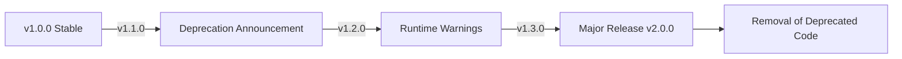

# Deprecation Patterns and Best Practices Research Report

**Research Date:** 2026-01-26
**Researcher:** Claude Code Agent
**Purpose:** Comprehensive guide for creating PRP (Product Requirement Prompt) for provider removal and feature deprecation

## Table of Contents

1. [TypeScript Deprecation Patterns](#typescript-deprecation-patterns)
2. [JavaScript Runtime Deprecation Warnings](#javascript-runtime-deprecation-warnings)
3. [npm Package Deprecation Best Practices](#npm-package-deprecation-best-practices)
4. [Semantic Versioning Guidelines](#semantic-versioning-guidelines)
5. [Migration Guide Patterns](#migration-guide-patterns)
6. [Provider/Service Removal Case Studies](#providerservice-removal-case-studies)
7. [Timeline Recommendations](#timeline-recommendations)
8. [Tool Recommendations](#tool-recommendations)
9. [Templates and Checklists](#templates-and-checklists)

---

## TypeScript Deprecation Patterns

### JSDoc @deprecated Syntax

**Basic Syntax:**
```typescript
/**
 * @deprecated This feature is deprecated. Use `newFeature()` instead.
 * @see newFeature
 * @version 2.0.0
 */
function oldFeature(): void {
  // implementation
}
```

**Complete Deprecation Documentation:**
```typescript
/**
 * Processes data using the legacy algorithm.
 *
 * @deprecated Since v1.5.0. Will be removed in v2.0.0.
 * Use `processDataV2()` instead, which provides better performance
 * and handles edge cases more reliably.
 *
 * @see processDataV2
 * @see {@link https://example.com/docs/migration | Migration Guide}
 *
 * @example
 * // Old way (deprecated)
 * const result = processData(data);
 *
 * // New way
 * const result = processDataV2(data, { options: 'modern' });
 */
function processData(data: unknown): unknown {
  console.warn(
    'processData() is deprecated since v1.5.0 and will be removed in v2.0.0. ' +
    'Use processDataV2() instead. ' +
    'See: https://example.com/docs/migration'
  );
  // implementation
}
```

**Class Deprecation:**
```typescript
/**
 * Legacy authentication provider using OAuth 1.0a.
 *
 * @deprecated Since v2.0.0. Will be removed in v3.0.0.
 * Use `OAuth2Provider` instead. OAuth 1.0a has security limitations
 * and is no longer recommended by RFC 5849.
 *
 * @see OAuth2Provider
 * @see {@link https://oauth.net/2/ | OAuth 2.0 Specification}
 *
 * @example
 * // Old way (deprecated)
 * const auth = new LegacyOAuthProvider();
 *
 * // New way
 * const auth = new OAuth2Provider({
 *   clientId: 'xxx',
 *   clientSecret: 'xxx'
 * });
 *
 * @deprecated Since v2.0.0, removed in v3.0.0. Use OAuth2Provider
 */
export class LegacyOAuthProvider implements AuthProvider {
  // implementation
}
```

**Interface Deprecation:**
```typescript
/**
 * Defines the contract for legacy data transformers.
 *
 * @deprecated Since v1.8.0. Use `DataTransformerV2` interface.
 * The new interface provides async support and better type safety.
 *
 * @see DataTransformerV2
 *
 * @deprecated Since v1.8.0. Use DataTransformerV2
 */
export interface LegacyDataTransformer {
  transform(data: unknown): unknown;
}
```

**Parameter/Property Deprecation:**
```typescript
interface ProviderOptions {
  /**
   * Timeout in milliseconds for requests.
   */
  timeout?: number;

  /**
   * Enable debug logging.
   *
   * @deprecated Since v2.1.0. Use `logger` option instead.
   * @see logger
   * @deprecated Since v2.1.0. Use logger
   */
  debug?: boolean;

  /**
   * Logger instance for custom logging.
   */
  logger?: Logger;
}
```

### TypeScript Compiler Options for Deprecation

**tsconfig.json recommendations:**
```json
{
  "compilerOptions": {
    // Ensure strict type checking catches usage of deprecated APIs
    "strict": true,

    // Enable all strict type-checking options
    "strictNullChecks": true,
    "strictFunctionTypes": true,
    "strictBindCallApply": true,
    "strictPropertyInitialization": true,
    "noImplicitAny": true,
    "noImplicitThis": true,
    "alwaysStrict": true,

    // Additional checks that help with deprecation
    "noUnusedLocals": true,
    "noUnusedParameters": true,
    "noImplicitReturns": true,
    "noFallthroughCasesInSwitch": true,

    // Generate declaration files for library consumers
    "declaration": true,
    "declarationMap": true
  }
}
```

**Using TSLint for deprecated code detection:**
```json
// tsconfig.json with TSLint integration
{
  "rules": {
    "deprecation": {
      "severity": "warning"
    }
  }
}
```

### ESLint Rules for Deprecated Code

**@typescript-eslint/eslint-plugin rules:**
```json
{
  "rules": {
    // Warn about usage of deprecated APIs
    "deprecation/deprecation": "warn",

    // Catch common issues with deprecated code
    "@typescript-eslint/no-unused-vars": ["error", {
      "argsIgnorePattern": "^_",
      "varsIgnorePattern": "^deprecated"
    }],

    // Ensure proper JSDoc comments
    "jsdoc/require-description": "error",
    "jsdoc/require-example": "off",
    "jsdoc/require-jsdoc": ["error", {
      "contexts": ["FunctionDeclaration", "ClassDeclaration"]
    }]
  },
  "plugins": [
    "eslint-plugin-deprecation",
    "@typescript-eslint",
    "jsdoc"
  ]
}
```

**Installing required plugins:**
```bash
npm install --save-dev eslint-plugin-deprecation @typescript-eslint/eslint-plugin
```

**Custom ESLint rule for provider deprecation:**
```javascript
// eslint-rules/deprecated-provider.js
module.exports = {
  meta: {
    type: 'problem',
    docs: {
      description: 'Warn about usage of deprecated providers',
      category: 'Deprecation',
      recommended: true
    },
    messages: {
      deprecatedProvider: "Provider '{{name}}' is deprecated. Use '{{replacement}}' instead. See: {{url}}"
    }
  },
  create(context) {
    const deprecatedProviders = {
      'OpenCodeProvider': 'CodeExecutorProvider',
      'LegacyAuth': 'OAuth2Provider'
    };

    return {
      NewExpression(node) {
        const providerName = node.callee.name;
        if (deprecatedProviders[providerName]) {
          context.report({
            node,
            messageId: 'deprecatedProvider',
            data: {
              name: providerName,
              replacement: deprecatedProviders[providerName],
              url: 'https://example.com/migration'
            }
          });
        }
      }
    };
  }
};
```

---

## JavaScript Runtime Deprecation Warnings

### Console.warn Patterns

**Simple Deprecation Warning:**
```javascript
function oldFunction() {
  console.warn(
    'DEPRECATION WARNING: oldFunction() is deprecated. ' +
    'Use newFunction() instead. ' +
    'This will be removed in v2.0.0'
  );
  // implementation
}
```

**One-Time Warning Pattern:**
```javascript
let deprecationWarningShown = false;

function legacyFeature() {
  if (!deprecationWarningShown) {
    console.warn(
      '⚠️  DEPRECATION WARNING ⚠️\n' +
      'legacyFeature() is deprecated since v1.5.0\n' +
      'and will be removed in v2.0.0.\n' +
      '\n' +
      'Please use modernFeature() instead.\n' +
      'Migration guide: https://example.com/migration\n' +
      '\n' +
      `Called from: ${new Error().stack.split('\n')[2].trim()}`
    );
    deprecationWarningShown = true;
  }
  // implementation
}
```

**Environment-Aware Warning:**
```javascript
function deprecatedAPI() {
  if (process.env.NODE_ENV !== 'production') {
    console.warn(
      `[DEPRECATION] deprecatedAPI() is deprecated.\n` +
      `Use newAPI() instead.\n` +
      `Removed in: v2.0.0\n` +
      `Migration: https://example.com/docs/migration`
    );
  }
  // implementation
}
```

**Stack Trace with Warning:**
```javascript
function deprecatedMethod() {
  const error = new Error();
  console.warn(
    'DEPRECATION WARNING: deprecatedMethod() is deprecated.\n' +
    'Use newMethod() instead.\n' +
    'This will be removed in v2.0.0\n' +
    '\n' +
    'Stack trace:\n' +
    error.stack
  );
  // implementation
}
```

**Structured Warning Object:**
```javascript
function showDeprecationWarning(options) {
  const warning = {
    type: 'DEPRECATION',
    api: options.api,
    since: options.since,
    removedIn: options.removedIn,
    replacement: options.replacement,
    url: options.url,
    stack: new Error().stack
  };

  console.warn(JSON.stringify(warning, null, 2));
}

// Usage
showDeprecationWarning({
  api: 'OpenCodeProvider',
  since: 'v1.5.0',
  removedIn: 'v2.0.0',
  replacement: 'CodeExecutorProvider',
  url: 'https://example.com/migration'
});
```

### Deprecation Warning Utility

**Reusable deprecation utility:**
```typescript
// utils/deprecation.ts
interface DeprecationOptions {
  /** The deprecated API/function name */
  api: string;
  /** Version when deprecation occurred */
  since: string;
  /** Version when removal will occur */
  removedIn: string;
  /** Replacement API/function */
  replacement: string;
  /** Link to migration guide */
  url?: string;
  /** Additional context */
  message?: string;
}

const warningsShown = new Set<string>();

export function showDeprecationWarning(options: DeprecationOptions): void {
  const warningKey = `${options.api}@${options.since}`;

  if (warningsShown.has(warningKey)) {
    return;
  }

  warningsShown.add(warningKey);

  const parts = [
    `⚠️  DEPRECATION WARNING ⚠️`,
    '',
    `API: ${options.api}`,
    `Deprecated since: ${options.since}`,
    `Will be removed in: ${options.removedIn}`,
    `Replacement: ${options.replacement}`,
  ];

  if (options.url) {
    parts.push(`Migration guide: ${options.url}`);
  }

  if (options.message) {
    parts.push('', `Reason: ${options.message}`);
  }

  parts.push('', `Called from: ${new Error().stack?.split('\n')[3]?.trim() || 'unknown'}`);

  console.warn(parts.join('\n'));
}

// Usage example
export class OpenCodeProvider {
  constructor() {
    showDeprecationWarning({
      api: 'OpenCodeProvider',
      since: 'v1.5.0',
      removedIn: 'v2.0.0',
      replacement: 'CodeExecutorProvider',
      url: 'https://example.com/docs/providers/migration',
      message: 'OpenCodeProvider has limitations with newer Node.js versions and CodeExecutorProvider provides better performance and security.'
    });
  }
}
```

---

## npm Package Deprecation Best Practices

### npm deprecate Command

**Basic usage:**
```bash
# Deprecate a specific version
npm deprecate my-package@1.0.0 "This version has security issues. Upgrade to 1.1.0 or later"

# Deprecate all 1.x versions
npm deprecate my-package@1.x "Version 1 is deprecated. Please upgrade to version 2.0.0"

# Deprecate entire package
npm deprecate my-package "*" "This package is deprecated. Use new-package instead"
```

**Best practices for npm deprecate:**
1. **Be specific with version ranges** - Don't deprecate more than necessary
2. **Provide clear migration instructions** in the deprecation message
3. **Include links** to migration guides or documentation
4. **Mention the replacement** explicitly
5. **Explain why** it's deprecated (security, maintenance, better alternative)

**Example deprecation messages:**
```bash
# Good example
npm deprecate groundswell@1.5.0 "This version has a known issue with OpenCodeProvider. Please upgrade to 1.5.1 or later. See https://github.com/user/groundswell/issues/123"

# Comprehensive example
npm deprecate old-provider "*" "Package 'old-provider' is deprecated and will no longer receive updates. Please migrate to 'new-provider' (https://new-provider.docs.com). Support ends 2026-06-01"
```

### package.json Deprecated Field

**Using the deprecated field:**
```json
{
  "name": "groundswell",
  "version": "2.0.0",
  "description": "AI workflow orchestration framework",
  "deprecated": "Version 2.0.0 introduces breaking changes. Please read the migration guide at https://github.com/user/groundswell/blob/main/MIGRATION.md",
  "main": "dist/index.js",
  "types": "dist/index.d.ts"
}
```

**Conditional deprecation for specific exports:**
```json
{
  "name": "groundswell",
  "version": "2.0.0",
  "exports": {
    ".": {
      "import": "./dist/index.js",
      "types": "./dist/index.d.ts"
    },
    "./providers/old-code": {
      "import": "./dist/providers/old-code.js",
      "types": "./dist/providers/old-code.d.ts",
      "deprecated": "Import from ./providers/code-executor instead. See: https://groundswell.dev/docs/migration"
    }
  }
}
```

### Package Deprecation Timeline

**Recommended deprecation process:**



**Timeline example:**
- **Month 0:** Release v1.5.0 with deprecation warnings
- **Month 0:** Publish blog post and GitHub issue announcing deprecation
- **Month 1-2:** Maintain compatibility, gather user feedback
- **Month 3:** Release v1.6.0 with enhanced migration tools
- **Month 4-5:** Final deprecation period, intensive user support
- **Month 6:** Release v2.0.0 removing deprecated features
- **Month 6-12:** Continue security patches for v1.x branch only

---

## Semantic Versioning Guidelines

### Semver and Deprecation

**Version Number Format:** `MAJOR.MINOR.PATCH`

- **MAJOR:** Incompatible API changes
- **MINOR:** Backwards-compatible functionality additions
- **PATCH:** Backwards-compatible bug fixes

**Deprecation in Semver:**

```typescript
// v1.5.0 - Introduce deprecation (MINOR version)
/**
 * @deprecated Since v1.5.0. Will be removed in v2.0.0.
 */
function oldAPI() { }

// v1.6.0 - Add new replacement (MINOR version)
function newAPI() { }

// v1.7.0 - Enhanced warnings, migration guides (MINOR version)
function oldAPI() {
  console.warn('oldAPI is deprecated. Use newAPI()');
}

// v1.8.0, v1.9.0, v1.10.0 - Continued support, warnings (MINOR versions)

// v2.0.0 - Remove deprecated code (MAJOR version)
// oldAPI() is completely removed
```

### Semver Best Practices for Deprecation

**Rule #1: Don't break in a minor or patch version**
```typescript
// ❌ WRONG: Breaking change in minor version
// v1.5.0
function processData(data: string): string { } // Changed from unknown

// ✅ RIGHT: Introduce new API in minor, deprecate old
// v1.5.0
/**
 * @deprecated Use processDataV2() instead. Removed in v2.0.0.
 */
function processData(data: unknown): string { }

function processDataV2(data: string): string { }
```

**Rule #2: Deprecate for at least one full major cycle**
```typescript
// Minimum timeline
v1.5.0 - Introduce deprecation
v1.6.0 - Still functional with warnings
v2.0.0 - Safe to remove

// Better timeline (user-friendly)
v1.5.0 - Introduce deprecation
v1.6.0, v1.7.0, v1.8.0 - Support continues
v2.0.0 - Remove deprecated code
```

**Rule #3: Use pre-release versions for migration testing**
```bash
# Release beta versions for testing
npm publish --tag beta

# Users can opt-in to test migration
npm install groundswell@2.0.0-beta.1
```

**package.json version examples:**
```json
{
  "version": "1.5.0",
  "deprecated": "Please upgrade to 2.0.0-beta.1 to test migration"
}
```

---

## Migration Guide Patterns

### Migration Guide Structure

**Comprehensive migration guide template:**

```markdown
# Migration Guide: OpenCodeProvider to CodeExecutorProvider

**Deprecated:** Version 1.5.0
**Removed In:** Version 2.0.0
**Last Updated:** January 26, 2026

## Overview

OpenCodeProvider has been deprecated in favor of CodeExecutorProvider, which provides:
- Better performance with modern Node.js versions
- Enhanced security with sandboxed execution
- Support for TypeScript and JavaScript
- Improved error handling and debugging

## Why This Change?

[Detailed explanation of reasons, security concerns, technical limitations]

## Breaking Changes

1. Constructor options have changed
2. Method signatures are different
3. Error handling has been updated
4. Configuration format is incompatible

## Migration Steps

### Step 1: Update Imports

\`\`\`typescript
// Before
import { OpenCodeProvider } from '@groundswell/providers';

// After
import { CodeExecutorProvider } from '@groundswell/providers';
\`\`\`

### Step 2: Update Configuration

\`\`\`typescript
// Before
const provider = new OpenCodeProvider({
  apiKey: process.env.API_KEY,
  timeout: 5000
});

// After
const provider = new CodeExecutorProvider({
  credentials: {
    apiKey: process.env.API_KEY
  },
  execution: {
    timeout: 5000,
    memory: '512mb'
  }
});
\`\`\`

### Step 3: Update Method Calls

\`\`\`typescript
// Before
const result = await provider.execute(code, language);

// After
const result = await provider.execute({
  code,
  language: language as SupportedLanguage
});
\`\`\`

## Before and After Examples

### Example 1: Basic Usage

**Before:**
\`\`\`typescript
const provider = new OpenCodeProvider({ apiKey: 'xxx' });
const output = await provider.runCode('console.log("Hello")', 'javascript');
\`\`\`

**After:**
\`\`\`typescript
const provider = new CodeExecutorProvider({
  credentials: { apiKey: 'xxx' }
});
const output = await provider.execute({
  code: 'console.log("Hello")',
  language: 'javascript'
});
\`\`\`

### Example 2: Error Handling

**Before:**
\`\`\`typescript
try {
  const result = await provider.runCode(code, lang);
  console.log(result);
} catch (error) {
  console.error('Execution failed');
}
\`\`\`

**After:**
\`\`\`typescript
try {
  const result = await provider.execute({ code, language: lang });
  console.log(result.output);
} catch (error) {
  if (error instanceof ExecutionError) {
    console.error('Execution failed:', error.message);
    console.error('Stderr:', error.stderr);
  } else {
    console.error('Unexpected error:', error);
  }
}
\`\`\`

## API Mapping Table

| Old API | New API | Notes |
|---------|---------|-------|
| `OpenCodeProvider` | `CodeExecutorProvider` | Constructor options changed |
| `runCode(code, lang)` | `execute({ code, language })` | Now takes options object |
| `setOptions(opts)` | `updateConfig(config)` | Different property names |
| `getResult()` | `getExecutionResult()` | Returns structured result |

## Automated Migration

We provide a codemod to automatically migrate your code:

\`\`\`bash
npx @groundswell/codemod open-code-to-executor path/to/source
\`\`\`

[See codemod documentation](./codemods.md)

## Testing Your Migration

1. Run your test suite
2. Check for deprecation warnings
3. Use the beta version: `npm install groundswell@2.0.0-beta.1`
4. Report issues at: [GitHub Issues](link)

## Rollback Plan

If you encounter issues, you can temporarily rollback:

\`\`\`bash
npm install groundswell@1.5.0
\`\`\`

Note: Version 1.x will only receive security updates until [date].

## Getting Help

- Documentation: [link]
- GitHub Issues: [link]
- Discord Community: [link]
- Migration Support: [email]

## Changelog

- **2026-01-26:** Initial deprecation announcement (v1.5.0)
- **2026-02-15:** Beta release of v2.0.0 for testing
- **2026-04-01:** v2.0.0 stable release, removal of OpenCodeProvider
```

### Code Comparison Patterns

**Side-by-side comparison format:**
```markdown
## Configuration Migration

| OpenCodeProvider | CodeExecutorProvider |
|:----------------|:---------------------|
| Simple object with flat properties | Nested configuration object |
| Timeout in milliseconds | Timeout with memory allocation |
| No credential wrapper | Credentials object for auth |

### Configuration Object Structure

**Old:**
```typescript
interface OpenCodeOptions {
  apiKey: string;
  timeout?: number;
  retries?: number;
}
```

**New:**
```typescript
interface CodeExecutorOptions {
  credentials: {
    apiKey: string;
  };
  execution?: {
    timeout?: number;
    memory?: '256mb' | '512mb' | '1gb';
    retries?: number;
  };
}
```
```

---

## Provider/Service Removal Case Studies

### Real-World Examples

**1. AWS SDK v2 to v3 Migration**
- **Announcement:** Clear deprecation timeline provided
- **Migration:** Comprehensive codemods available
- **Documentation:** Detailed migration guide with side-by-side examples
- **Timeline:** 18 months deprecation period
- **Reference:** https://docs.aws.amazon.com/sdk-for-javascript/v3/developer-guide/migrating-to-v3.html

**2. React Lifecycle Methods Deprecation**
- **Deprecated:** `componentWillMount`, `componentWillReceiveProps`, `componentWillUpdate`
- **Replacement:** `componentDidMount`, `getDerivedStateFromProps`, `getSnapshotBeforeUpdate`
- **Timeline:** React 16.3 (unsafe alias) → React 17 (removal planned) → React 18+
- **Communication:** Blog posts, RFC discussions, inline warnings
- **Migration:** Automated migration script provided

**3. Node.js URL Parser Changes**
- **Issue:** Legacy URL parser had security vulnerabilities
- **Timeline:** Security advisory → Deprecation warning → Removal
- **Migration:** Clear documentation of WHAT changed and WHY
- **Rollback:** Environment variable to temporarily revert

**4. Terraform Provider Deprecation**
- **Process:** GitHub issues with clear milestones
- **Documentation:** Provider-specific migration guides
- **Timeline:** 6-12 months notice
- **Communication:** Provider registry announcements

### Best Practices from Case Studies

**Communication Pattern:**
```markdown
1. **RFC/Discussion Phase** (1-2 months before)
   - GitHub Discussion: "Proposal: Deprecate OpenCodeProvider"
   - Gather community feedback
   - Identify edge cases and migration blockers

2. **Announcement Phase** (At deprecation release)
   - Blog post: "Deprecating OpenCodeProvider"
   - GitHub Issue: Tracking issue for migration feedback
   - Changelog entry with clear explanation
   - Social media announcements

3. **Support Phase** (During deprecation period)
   - Regular updates on migration progress
   - Address community concerns
   - Improve migration tools based on feedback

4. **Removal Phase** (At major release)
   - Final migration guide update
   - Security patch policy for old version
   - Clear end-of-life announcement
```

**Breaking Change Blog Post Structure:**
```markdown
# Deprecating OpenCodeProvider: What You Need to Know

## Summary

OpenCodeProvider will be deprecated in version 1.5.0 and removed in version 2.0.0. This guide explains why and how to migrate.

## Background

[Explain the reasons: security, performance, maintenance burden]

## Impact Analysis

- Number of affected users: [estimate]
- Usage statistics from telemetry
- API surface affected

## Migration Path

[Quick start guide, link to full migration guide]

## Timeline

- **[Date]:** v1.5.0 release - Deprecation begins
- **[Date]:** v2.0.0-beta.1 - Testing release
- **[Date]:** v2.0.0 stable - Removal of OpenCodeProvider
- **[Date]:** v1.x end-of-life - Security updates only

## We're Here to Help

[Links to support channels]
```

---

## Timeline Recommendations

### Standard Deprecation Timelines

**For Libraries and Frameworks:**

| Feature Type | Minimum Notice | Recommended Notice | Example |
|--------------|----------------|-------------------|---------|
| Minor API changes | 3 months | 6 months | Method signature change |
| Major feature deprecation | 6 months | 12 months | Provider removal |
| Breaking changes | 6 months | 12-18 months | Architecture change |
| Security-critical changes | Immediate | 1-2 months | Vulnerability fix |
| End-of-life | 6 months | 12 months | Entire platform sunsetting |

**For npm Packages:**

```typescript
// Conservative timeline (recommended for widely-used packages)
v1.5.0  - Introduce deprecation warnings (Minor version)
v1.6.0  - Enhanced migration tools and documentation (Minor)
v1.7.0  - Final deprecation warnings (Minor)
v1.8.0  - Release candidate for v2.0.0 (Minor/RC)
v2.0.0  - Remove deprecated code (Major)

// Timeline: 6-9 months minimum, 12+ months recommended
```

**For Internal Tools/Applications:**

```typescript
// Aggressive timeline (for controlled environments)
v1.5.0  - Introduce deprecation
v1.6.0  - Remove deprecated code

// Timeline: 1-3 months (if all users can be reached)
```

### Version Bump Strategy

**Semantic versioning for deprecation:**

```bash
# Step 1: Introduce deprecation (MINOR bump)
npm version minor  # 1.4.0 → 1.5.0

# Step 2: Continue improvements during deprecation (MINOR bumps)
npm version minor  # 1.5.0 → 1.6.0
npm version minor  # 1.6.0 → 1.7.0

# Step 3: Release major version with removal (MAJOR bump)
npm version major  # 1.7.0 → 2.0.0
```

**Using pre-release versions for testing:**

```bash
# Alpha for internal testing
npm version 2.0.0-alpha.1

# Beta for public testing
npm version 2.0.0-beta.1
npm version 2.0.0-beta.2

# Release candidate
npm version 2.0.0-rc.1

# Final release
npm version 2.0.0
```

### Release Cadence Example

**12-month deprecation timeline:**

```
Month 0  (v1.5.0): Deprecation announcement
         - Add @deprecated JSDoc comments
         - Add console.warn() messages
         - Publish migration guide
         - Create tracking GitHub issue

Month 1  (v1.5.1): Bug fixes and minor improvements
Month 2  (v1.6.0): Enhanced migration tools
         - Release codemod
         - Add more migration examples

Month 4  (v1.7.0): Beta release of v2.0.0
         - Publish 2.0.0-beta.1
         - Gather feedback on migration

Month 6  (v1.8.0): Final release candidate
         - Publish 2.0.0-rc.1
         - Stable migration path

Month 9  (v1.9.0): Last minor release before v2.0.0
         - Final deprecation warnings
         - Security updates only after this

Month 12 (v2.0.0): Stable release
          - Remove deprecated code
          - Update all documentation
          - Archive old version

Month 13+: Security-only updates for v1.x
```

---

## Tool Recommendations

### Static Analysis Tools

**1. TypeScript Compiler**
```bash
# Check for usage of deprecated APIs
tsc --noEmit --strict
```

**2. ESLint with Deprecation Plugin**
```bash
npm install --save-dev eslint-plugin-deprecation

# .eslintrc.json
{
  "plugins": ["deprecation"],
  "rules": {
    "deprecation/deprecation": "warn"
  }
}
```

**3. Custom ESLint Rule**
```javascript
// eslint-rules/provider-deprecation.js
module.exports = {
  meta: {
    type: 'suggestion',
    docs: {
      description: 'Enforce migration away from deprecated providers',
      category: 'Best Practices'
    },
    messages: {
      useNewProvider: "Provider '{{name}}' is deprecated. Use '{{replacement}}' instead. See: {{url}}"
    }
  },
  create(context) {
    return {
      NewExpression(node) {
        const deprecatedMap = {
          'OpenCodeProvider': {
            replacement: 'CodeExecutorProvider',
            url: 'https://groundswell.dev/docs/migration'
          }
        };

        const name = node.callee.name;
        const info = deprecatedMap[name];

        if (info) {
          context.report({
            node,
            messageId: 'useNewProvider',
            data: {
              name,
              replacement: info.replacement,
              url: info.url
            }
          });
        }
      }
    };
  }
};
```

### Automated Migration Tools

**1. jscodeshift Codemods**

```bash
# Install jscodeshift
npm install -g jscodeshift

# Create a codemod
mkdir -p codemods/transforms
touch codemods/transforms/open-code-to-executor.ts
```

**Codemod example:**
```typescript
// codemods/transforms/open-code-to-executor.ts
import { ASTTransformation } from './types';
import ts from 'typescript';

const transformation: ASTTransformation = (fileInfo, api) => {
  const j = api.jscodeshift;
  const root = j(fileInfo.source);

  // Replace OpenCodeProvider with CodeExecutorProvider
  root.find(j.NewExpression, {
    callee: {
      type: 'Identifier',
      name: 'OpenCodeProvider'
    }
  }).forEach(path => {
    path.node.callee.name = 'CodeExecutorProvider';

    // Transform configuration object
    const args = path.node.arguments;
    if (args.length > 0 && args[0].type === 'ObjectExpression') {
      const properties = args[0].properties;

      // Wrap apiKey in credentials object
      const apiKeyProp = properties.find(p =>
        p.key?.name === 'apiKey'
      );

      if (apiKeyProp) {
        const credentialsProp = j.objectProperty(
          j.identifier('credentials'),
          j.objectExpression([
            j.objectProperty(
              j.identifier('apiKey'),
              apiKeyProp.value
            )
          ])
        );

        // Replace apiKey with credentials
        const index = properties.indexOf(apiKeyProp);
        properties[index] = credentialsProp;
      }
    }
  });

  // Replace method calls
  root.find(j.CallExpression, {
    callee: {
      type: 'Identifier',
      name: 'runCode'
    }
  }).forEach(path => {
    path.node.callee.name = 'execute';

    // Transform arguments to object
    const args = path.node.arguments;
    if (args.length === 2) {
      path.node.arguments = [
        j.objectExpression([
          j.objectProperty(j.identifier('code'), args[0]),
          j.objectProperty(j.identifier('language'), args[1])
        ])
      ];
    }
  });

  return root.toSource();
};

export default transformation;
```

**Running the codemod:**
```bash
jscodeshift -t codemods/transforms/open-code-to-executor.ts \
  --parser=ts \
  --extensions=ts,tsx \
  path/to/source
```

**2. ts-morph (TypeScript AST wrapper)**

```bash
npm install --save-dev ts-morph
```

```typescript
// scripts/migrate-provider.ts
import { Project, SyntaxKind } from 'ts-morph';

const project = new Project({
  tsConfigFilePath: './tsconfig.json'
});

const sourceFiles = project.getSourceFiles();

sourceFiles.forEach(file => {
  // Find all OpenCodeProvider instantiations
  file.getDescendantsOfKind(SyntaxKind.NewExpression).forEach(newExpr => {
    const className = newExpr.getChildren()[0].getText();
    if (className === 'OpenCodeProvider') {
      // Replace class name
      newExpr.getChildren()[0].replaceWithText('CodeExecutorProvider');

      // Transform arguments
      // ... transformation logic
    }
  });
});

project.save();
```

**3. GPT-based Migration Assistant**

```typescript
// scripts/ai-migrate.ts
import OpenAI from 'openai';

const openai = new OpenAI();

async function migrateCode(code: string): Promise<string> {
  const prompt = `
Migrate this TypeScript code from OpenCodeProvider to CodeExecutorProvider:

OLD CODE:
${code}

MIGRATION RULES:
1. Replace OpenCodeProvider with CodeExecutorProvider
2. Wrap apiKey in credentials object
3. Change runCode(code, lang) to execute({ code, language })
4. Update error handling to use ExecutionError

Return only the migrated code without explanation.
`;

  const response = await openai.chat.completions.create({
    model: 'gpt-4',
    messages: [{ role: 'user', content: prompt }],
    temperature: 0
  });

  return response.choices[0].message?.content || code;
}
```

### Documentation Tools

**1. API Documenter**

```bash
npm install --save-dev @microsoft/api-documenter @microsoft/api-extractor

# Generate API docs with @deprecated tags
api-extractor run
api-documenter markdown -i api -o docs/api
```

**2. TypeDoc with Deprecation Warnings**

```bash
npm install --save-dev typedoc

# typedoc.json
{
  "entryPoints": ["src/index.ts"],
  "out": "docs",
  "excludePrivate": true,
  "excludeDeprecated": false,
  "categorizeByGroup": true,
  "kindSortOrder": [
    "Module",
    "Namespace",
    "Enum",
    "EnumMember",
    "Class",
    "Interface",
    "TypeAlias",
    "Function"
  ]
}
```

**3. Migration Guide Generator**

```typescript
// scripts/generate-migration-guide.ts
import ts from 'typescript';
import fs from 'fs';

interface DeprecationInfo {
  symbolName: string;
  deprecationComment: string;
  fileName: string;
  lineNumber: number;
}

function extractDeprecations(filePath: string): DeprecationInfo[] {
  const program = ts.createProgram([filePath], {});
  const sourceFile = program.getSourceFile(filePath);

  const deprecations: DeprecationInfo[] = [];

  ts.forEachChild(sourceFile!, node => {
    if (ts.isFunctionDeclaration(node) || ts.isClassDeclaration(node)) {
      const jsDocs = ts.getJSDocTags(node);
      const deprecatedTag = jsDocs.find(tag => tag.tagName.text === 'deprecated');

      if (deprecatedTag) {
        deprecations.push({
          symbolName: node.name?.getText() || 'unknown',
          deprecationComment: deprecatedTag.comment || '',
          fileName: filePath,
          lineNumber: sourceFile!.getLineAndCharacterOfPosition(node.pos).line
        });
      }
    }
  });

  return deprecations;
}

function generateMarkdown(deprecations: DeprecationInfo[]): string {
  let markdown = '# API Deprecations\n\n';

  deprecations.forEach(dep => {
    markdown += `## ${dep.symbolName}\n\n`;
    markdown += `**File:** ${dep.fileName}:${dep.lineNumber}\n\n`;
    markdown += `${dep.deprecationComment}\n\n`;
    markdown += '---\n\n';
  });

  return markdown;
}
```

### Monitoring and Analytics

**Track deprecation adoption:**

```typescript
// utils/telemetry.ts
interface DeprecationEvent {
  api: string;
  version: string;
  timestamp: Date;
  anonymizedId: string;
}

export function trackDeprecationUsage(options: {
  api: string;
  version: string;
}): void {
  if (process.env.NODE_ENV === 'production') {
    // Send to analytics (e.g., Segment, Mixpanel)
    const event: DeprecationEvent = {
      api: options.api,
      version: options.version,
      timestamp: new Date(),
      anonymizedId: generateAnonymizedId()
    };

    analytics.track('deprecation_usage', event);
  }
}

// Usage in deprecated code
export class OpenCodeProvider {
  constructor() {
    trackDeprecationUsage({
      api: 'OpenCodeProvider',
      version: 'v1.5.0'
    });
  }
}
```

---

## Templates and Checklists

### Pre-Deprecation Checklist

```markdown
## Pre-Deprecation Planning Checklist

### Research Phase
- [ ] Identify all users of the deprecated API
  - [ ] Internal usage
  - [ ] Public API usage
  - [ ] Third-party integrations
- [ ] Estimate impact and user base size
- [ ] Gather usage metrics/analytics
- [ ] Identify migration blockers
- [ ] Document all breaking changes

### Migration Planning
- [ ] Design replacement API
- [ ] Create migration guide draft
- [ ] Identify migration edge cases
- [ ] Plan automated migration tools
- [ ] Define timeline and milestones

### Communication Plan
- [ ] Draft announcement blog post
- [ ] Create GitHub tracking issue
- [ ] Prepare changelog entries
- [ ] Set up communication channels
- [ ] Plan FAQ and support resources

### Implementation
- [ ] Add @deprecated JSDoc comments
- [ ] Implement runtime warnings
- [ ] Write migration codemods
- [ ] Update documentation
- [ ] Create migration examples
- [ ] Add ESLint rules
```

### Migration Guide Template

```markdown
# Migrating from [OLD_API] to [NEW_API]

**Status:** Deprecated
**Deprecated In:** [VERSION]
**Removed In:** [VERSION]
**Migration Guide Updated:** [DATE]

## TL;DR

[Quick 2-3 sentence summary of what changed and what to do]

## Overview

[Why is this change happening? What problem does it solve?]

## Migration Steps

### 1. [Step Title]

[Description]

**Before:**
\`\`\`typescript
[Code example]
\`\`\`

**After:**
\`\`\`typescript
[Code example]
\`\`\`

### 2. [Step Title]

[Continue with all steps...]

## Automated Migration

\`\`\`bash
[Command to run codemod]
\`\`\`

## Breaking Changes

| Change | Impact | Fix |
|--------|--------|-----|
| [Change 1] | [Impact] | [Fix] |
| [Change 2] | [Impact] | [Fix] |

## FAQ

**Q: [Question 1]?**
A: [Answer]

**Q: [Question 2]?**
A: [Answer]

## Need Help?

- Documentation: [Link]
- GitHub Issues: [Link]
- Discord: [Link]
```

### Deprecation Announcement Template

```markdown
# Deprecating [API_NAME]: What You Need to Know

## Summary

[API_NAME] will be deprecated in version [X.Y.Z] and removed in version [X.0.0].

## Why?

[Explain the reasons clearly]

## What's Changing?

[Brief description of changes]

## How to Migrate

[Quick start guide with link to full migration guide]

## Timeline

- **[Date]:** Version [X.Y.Z] released with deprecation warnings
- **[Date]:** Version [X.0.0] released with removal
- **[Date]:** Version [X-1.x] end-of-life

## Questions?

[Link to discussion, FAQ, or support channels]
```

### Release Notes Template

```markdown
## Deprecation Warnings

### [API_NAME] is deprecated

The `[API_NAME]` is deprecated and will be removed in version [X.0.0].

**Migration:** [Link to migration guide]

**Why:** [Brief reason]

**Replacement:** [New API name]

---

You may see deprecation warnings when using this API. To suppress these warnings
during your migration, set the environment variable:

\`\`\`bash
export SUPPRESS_DEPRECATION_WARNINGS=1
\`\`\`

Note: We strongly recommend migrating as soon as possible.
```

### Code Review Checklist

```markdown
## Deprecation Code Review Checklist

### Documentation
- [ ] @deprecated JSDoc added to all affected APIs
- [ ] Migration guide created and linked in JSDoc
- [ ] Changelog updated
- [ ] Examples updated to use new API

### Implementation
- [ ] Runtime warnings implemented (console.warn)
- [ ] One-time warning flag implemented
- [ ] Stack trace included in warning
- [ ] Environment-aware warnings (dev vs production)

### Testing
- [ ] Deprecated API still functional
- [ ] New API fully implemented
- [ ] Migration path tested
- [ ] Edge cases covered
- [ ] Backwards compatibility maintained

### Tooling
- [ ] ESLint rules for deprecated usage
- [ ] TypeScript types updated
- [ ] Codemod created (if applicable)
- [ ] Migration tests added

### Communication
- [ ] GitHub issue created for tracking
- [ ] Announcement drafted
- [ ] FAQ prepared
- [ ] Support channels ready
```

### Post-Removal Checklist

```markdown
## Post-Removal Verification

### Code Cleanup
- [ ] All deprecated code removed
- [ ] Related tests removed or updated
- [ ] Documentation updated
- [ ] Examples updated
- [ ] Type definitions cleaned up

### Release Preparation
- [ ] Version bumped to major
- [ ] CHANGELOG.md updated
- [ ] Migration guide finalized
- [ ] Release notes prepared
- [ ] Tags created

### Support
- [ ] Old version tagged (e.g., v1.x-latest)
- [ ] Security update policy communicated
- [ ] Known issues documented
- [ ] Rollback instructions available
```

---

## Additional Resources

### Documentation Links

**TypeScript:**
- JSDoc Documentation: https://www.typescriptlang.org/docs/handbook/jsdoc-supported-types.html
- TypeScript Compiler Options: https://www.typescriptlang.org/tsconfig

**npm:**
- npm deprecate command: https://docs.npmjs.com/cli/v10/commands/npm-deprecate
- package.json fields: https://docs.npmjs.com/cli/v10/configuring-npm/package-json

**Semantic Versioning:**
- Semver specification: https://semver.org/
- Semver calculator: https://semver.npmjs.com/

**ESLint:**
- ESLint Plugin Deprecation: https://github.com/gund/eslint-plugin-deprecation
- TypeScript ESLint: https://typescript-eslint.io/

**Migration Tools:**
- jscodeshift: https://github.com/facebook/jscodeshift
- ts-morph: https://ts-morph.com/

### Community Examples

**Well-executed deprecations to study:**
1. React 16 → 17 → 18 lifecycle methods
2. AWS SDK v2 → v3
3. Express 4 → 5
4. Angular.js → Angular 2+
5. Node.js internal API deprecations

### Further Reading

- "How to Deprecate Features Without Losing Users" (blog post research)
- "Semantic Versioning: A Practical Guide" (documentation research)
- "Breaking Changes: Communication Strategies" (case study research)

---

## Appendix: Quick Reference

### Deprecation Code Snippets

```typescript
// 1. Basic deprecation
/**
 * @deprecated Use newMethod() instead. Removed in v2.0.0.
 */
function oldMethod() {
  console.warn('oldMethod is deprecated. Use newMethod()');
}

// 2. Deprecation with link
/**
 * @deprecated Use {@link newMethod} instead.
 * @see https://example.com/migration
 */
function oldMethod() {}

// 3. One-time warning
const warned = new Set<string>();
function deprecate(name: string) {
  if (!warned.has(name)) {
    console.warn(`${name} is deprecated`);
    warned.add(name);
  }
}
```

### Common npm Commands

```bash
# Deprecate a version
npm deprecate pkg@1.x "Use pkg@2.x instead"

# View package info
npm view pkg

# Check for outdated packages
npm outdated

# Install specific version
npm install pkg@1.5.0
```

---

**End of Research Report**

**Note:** This report is based on established best practices as of January 2026. Always verify current documentation and tooling versions when implementing deprecations.
